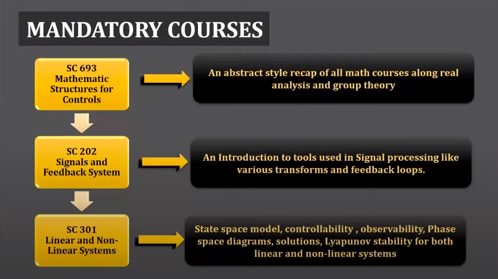
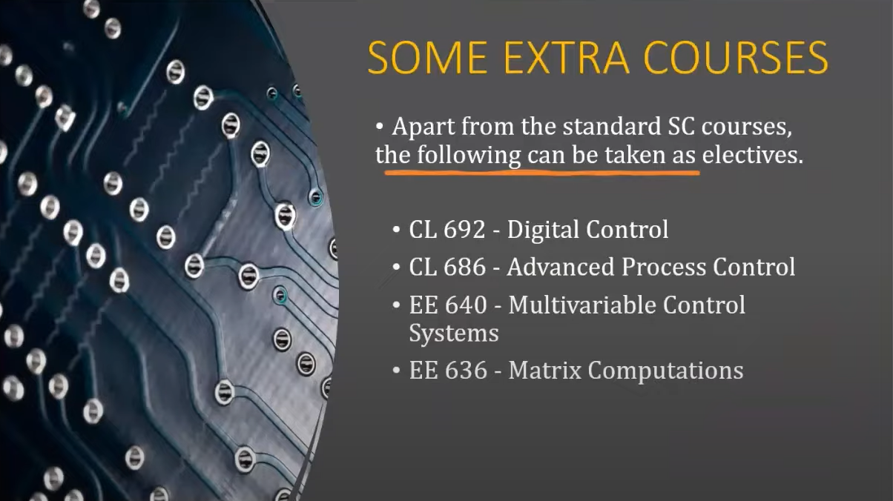

# SYSCON MINOR INFO
1. 5 courses to be done
2. 3 mandatory and 2 electives
3. 693->202->301 (This is preffered order for the minor) are the mandatory courses.
*MORE INFO ->*

*ELECTIVES* 

*NOTE - If you like applied maths, then good for you. Not directly helpful in AI ML, MATH HEAVY!!!*
