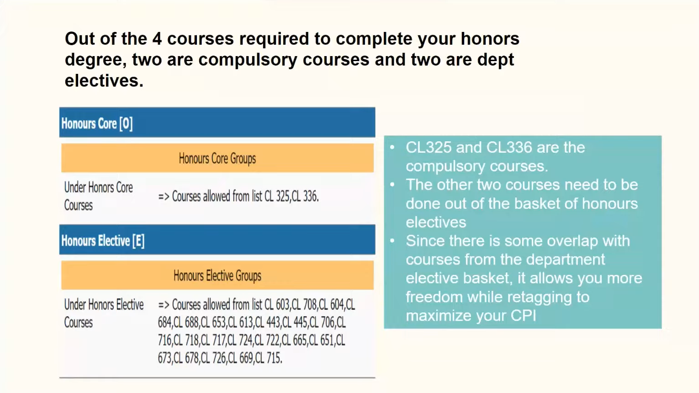

# HONORS
1. Out of the 4 courses needed to be completed, 2 are compulsory and 2 are dept electives.
2. CL325(even semester), CL336(odd semester) are compulsory
3. Following are the details of the CHEA honor.
 
4. SLP - IDP => both semesters -> Supervised Learning Project partnered with industry companies who give real life problems to solve under profs (A DEPT ELECTIVE)