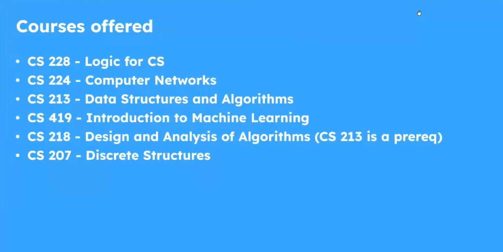
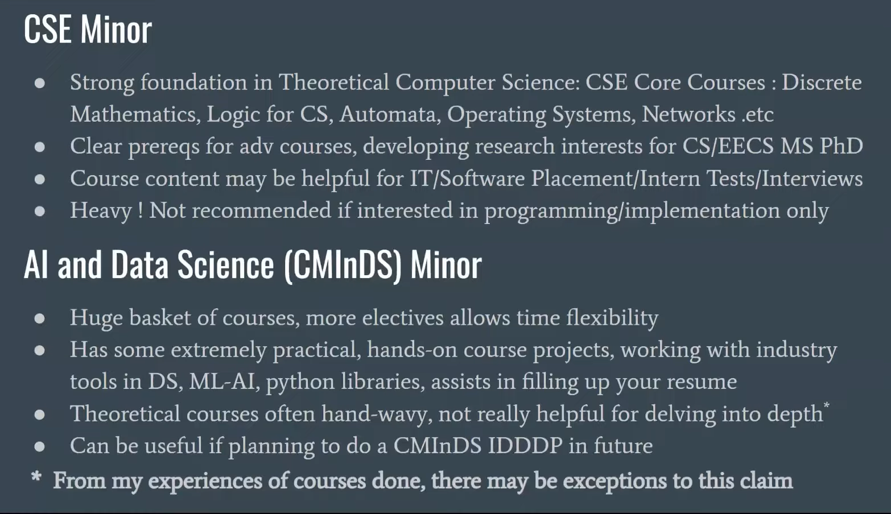
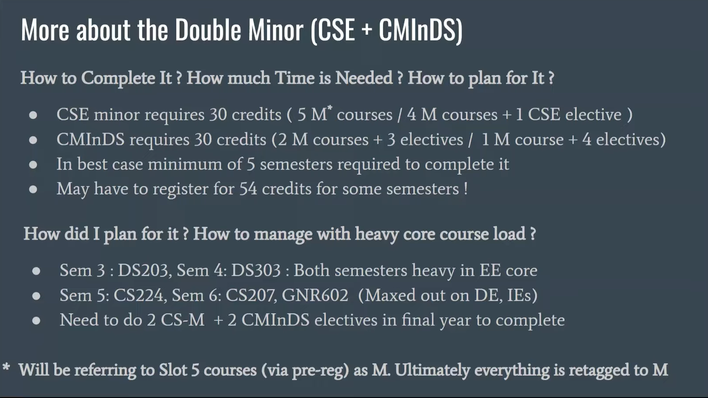

# MINOR INFO CS
1. If enjoyed CS101 and problem solving 
2. No Programming though, BIG-ASS-PROOFS to be written sometimes.
3. Dont take up minor just for IITB CSE Tag.
4. Less application, more algos in DSA, ML etc. *THEORY!!!*

The 1st two courses are opening courses for the minor in 2nd year.
DSA cutoff is a bit over 8+
228 - FUN
213 - Popular and tough to get (problem solvings)

*MORE ABOUT CS MINORS*

NOTE - DONT TAKE UP THEM THINKING YOULL DO CODING

*HOW TO COMPLETE MINOR*
