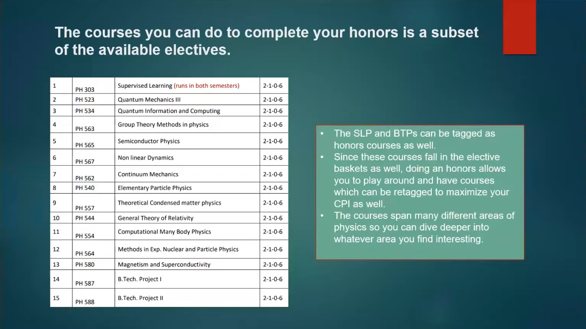
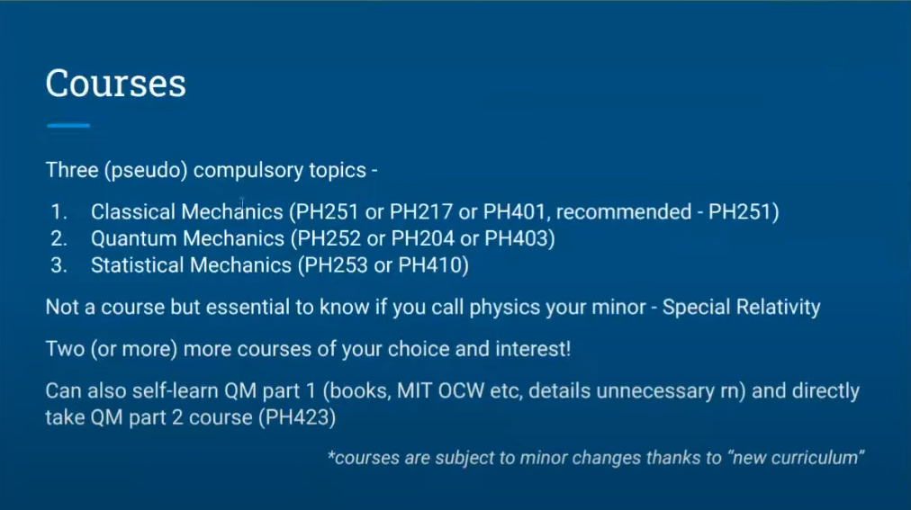

# HONORS IN EP
1. Following is the list of allowed courses which can be retagged as honors courses and are subset of EP dept electives.
  
2. SLP AND BTPs can be tagged as honor courses as well.
3. Can help to maximize CPI as well.
4. Span over large area of physics.

# MINORS IN PHYSICS

