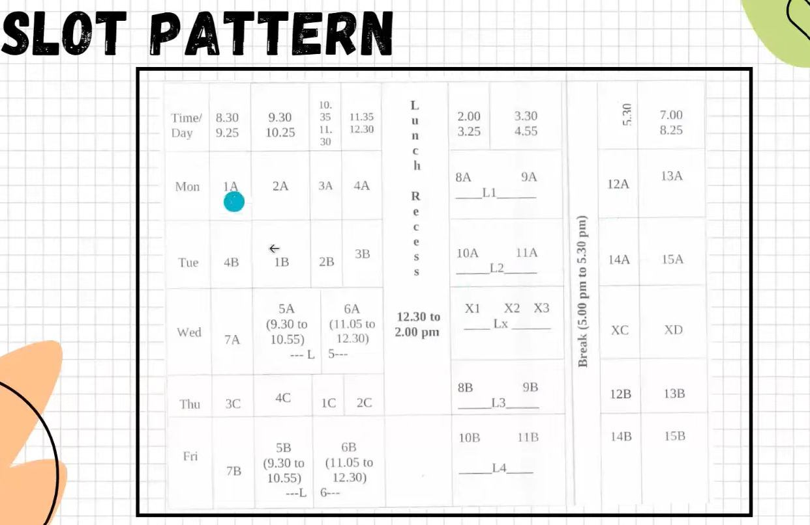
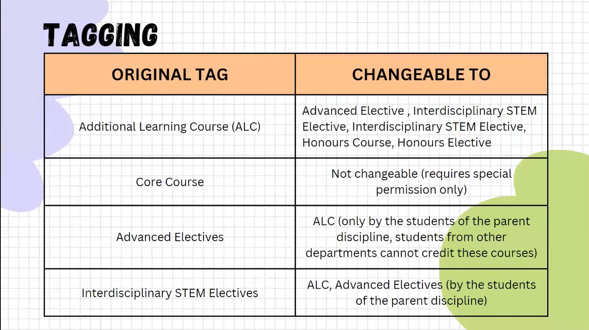

*Compulsory AI ML Course - in 2nd year*

*HASMED CORE COURSES -* 
1.  ECON101 (Economics) in 3rd Sem
2.  Design Thinking (IDC) in 4th Sem

# INFO
    8-10 Dept Core Courses Need to be completed by 5th/6th Sem.
    10-15 Dept Electives
    7th and 8th Sem for Electives

NEW CURRICULUM CONDITIONS
1. ~30 credits (approx 5 courses) per Sem.
2. Overall Component Courses
    * Dept Courses
    * Dept Electives
    * BTech Project (BTP) 
    NOTE - Either do BTP or another set of dept electives.
    * Courses on Engineering Skills
    * HASMED
        1. Core
        2. Electives
    * STEM (Insti Electives)
    * Flexible Electives (30 credits freedom)
        1. Department
        2. STEM (Interdisciplinary)
        3. HASMED (Interdisciplinary)

# MINORS
Secondary programs along with majors, these are Interdisciplinary (any dept minor can be done other than own dept) - 30 cred courses by last sem to get minor. Each dept has own criteria
1. Some dept have Only Electives
2. Some dept have Only Compulsory Courses
3. Some have hybrid 
4. To know about courses in specific dept
    ASC -> Academic -> All About Courses -> Running Courses
5. Minor CPI different from Major CPI
6. How to register for such courses - Pre-registration

# HONORS
1. Can be taken in parent department only - to complete it, 24 credit courses 
2. Can do Electives (Or BTP if dept allows it)
3. How to register - Tagging of courses.

# ELECTIVES
1. Insti Electives - STEM, HASMED (from other departments)
2. Dept Electives -
    Advanced Electives - Dive Deeper in department
    Interdisciplinary STEM - Related to department indirectly but from STEM
    Interdisciplinary HASMED - Related to department indirectly but from HASMED 

# ADDITIONAL LEARNING COURSES (ALCs)
1. As many ALC as possible
2. Condition - Adhere to credit limit of that particular SEM
3. Does not get included in CPI
4. Retaggable - convert to elective/minor
5. Shows up in transcript

# AUDITS - MAX 2 COURSES in BTech 
1. Do get grades (AU grade only)
2. Less efforts (Easier, less time/effort requirement)
3. Does not count in CPI
4. Not taggable

# SIT THROUGHS - LEAST EFFORTS REQUIRED
1. No registration
2. Just need instructors permission
3. Shouldnt clash with any credited courses 
4. No CPI inclusion
5. No Exams, Grades
6. Does not show in transcript
7. Just out of interest

*REGISTRATION*
1. From second year, apart from compulsory courses, complete curriculum is decided by student
2. Always at beginning of a SEM
3. DO ABIDE BY THE REG PERIOD AS STRICT RULES IN IITB
4. Credit limit set by academic standing - 

*Course Adjustment*
1. suppose one takes ALCs and within one week and you dont like it, then you can deregister it without any penalties
2. also can reg for a new course if you think you are interested in certain course 
3. Course adjustment period is like a DEMO class feedback.
4. Some courses may/may-not require fac-ads permission, if they do, mentioned in ASC
5. CANT DO LESS THAN 18 CREDITS PER SEM (OVERALL)

*Dropping of courses*
1. After course adjustment period if u feel u cant cope up with certain non compulsory course, around the time of mid sems (after mid sems), one can drop/de-enroll from a certain course.
2. creds should not drop below 18
3. if dropped within course window, results in W grade (no problems)
4. after window, results in DR grade which means course dropped (shows up in transcript)
5. Needs permission from fac-ad
6. Generally comes  20-30 days after mid sems

# COURSE SLOTS
1. during reg or pre-reg, DO CHECK course slots on ASC

2. PLS DO UNDERSTAND HOW SLOTS WORK AND WHAT SLOT NUMBER MEANS

# ACADEMIC STANDINGS
1. CPI >= 8 and NO BACKLOGS (even W grade is a backlog) -> MAX 54 Creds
2. CPI < 8 and NO BACKLOGS (even W grade is a backlog) -> MAX 48 Creds

# RETAGGING OF COURSES
1. Does not affect CPI!!!
2. Comes near end of degree.
3. Retagging can be done only once.
4. Tag of course tells type of course.
5. Two windows - 
    one at end of btech program.
    one at end of 3rd year.
6. A good practise is take a course as ALC and then retag at end as per needs.
7. Use this map for retagging.

